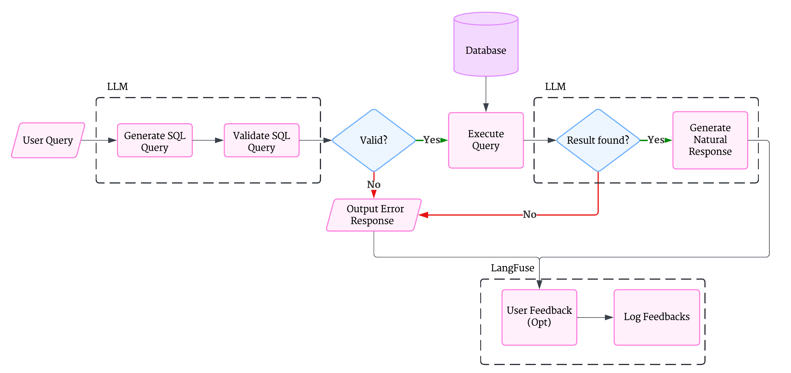

# Airline Data Query Assistant 🛫

A natural language interface for querying airline/flight data using LLMs

## Workflow Diagram



## Features

- ✈️ Natural language to SQL conversion using LLMs
- 🔍 SQL query validation and execution
- 📊 Results conversion to human-readable format
- 🌐 Web interface for easy interaction
- ✅ Comprehensive testing suite
- 📁 Structured project layout with Poetry dependency management

## Installation

### Prerequisites
- Python 3.9+

### Setup

# Clone the repository
```bash
git clone https://github.com/gtmray/smart-air
cd smart-air
```

# Install poetry
```bash
pip install poetry
```

# Install dependencies
```bash
poetry install
```

# Configure environment variables for LLM access and API configurations (in .env file)
```bash
HOSTNAME=localhost
PORT=<YOUR_AVAILABLE_PORT>

API_TYPE=<enter azure if using azure else comment this out>
OPENAI_API_VERSION=<YOUR_API_VERSION_IF_USING_AZURE_API_TYPE>

API_BASE_URL=<YOUR_API_BASE_URL>
API_KEY=<YOUR_API_KEY>
MODEL_NAME=<YOUR_MODEL_NAME>
```

# Store raw files downloaded from Kaggle using KaggleHub to src/sqlite_db/raw_data
See: https://github.com/Kaggle/kagglehub or download from kaggle UI

# Create database
```bash
poetry run python src/sqlite_db/create.py
```

# Start the application
```bash
poetry run src/app/main.py
```

# Access the web interface
```bash
http://localhost:<YOUR_ASSIGNED_PORT>
```

## Future Improvements

- Integrate industry standard database
- Add support for real-time streaming data
- Explore multi-model orchestration for complex queries
- Expand testing coverage to include performance benchmarks
